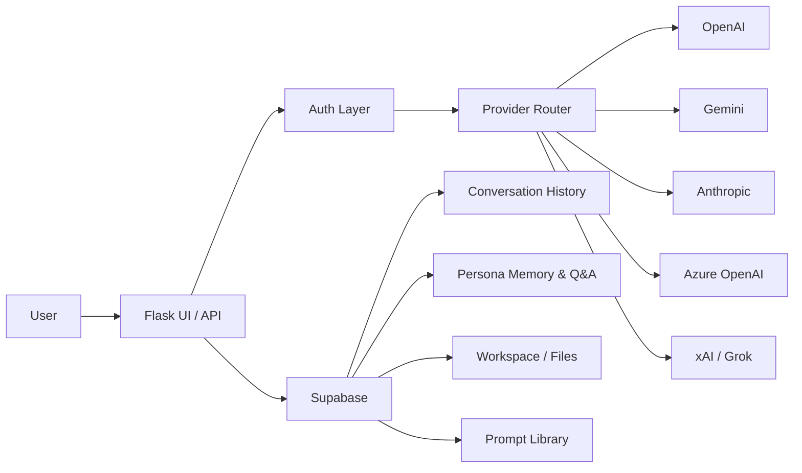

# ⚡ AI Hub — By Shinwook Yi


**Multi-AI Platform** — Access ChatGPT, Gemini, Azure OpenAI, Claude, and Grok through a single unified interface with 67 role-playing personas, multi-stakeholder analysis modes, and enterprise-grade security.

🌐 **Live Demo**: [https://ai-hub-zqpf.onrender.com](https://ai-hub-zqpf.onrender.com/)


---

## ✨ Features

### 🤖 5 AI Providers in One Place
| Provider | Model | API |
|----------|-------|-----|
| **ChatGPT** | gpt-4o-mini | OpenAI |
| **Gemini** | gemini-2.5-flash | Google AI |
| **Azure OpenAI** | gpt-4o-mini | Microsoft Azure |
| **Claude** | claude-sonnet-4 | Anthropic |
| **Grok** | grok-3-mini-fast | xAI |

### 🎯 11 Interaction Modes
- 💬 **Chat** — 1-on-1 conversation with any AI
- 🔄 **Compare All** — Ask all AIs simultaneously and compare responses side by side
- ⚔️ **Debate** — AI vs AI structured debate on any topic
- 🗣️ **Discussion** — Round-robin discussion with all available AIs
- 🏆 **Best Answer** — All AIs answer, then cross-evaluate and vote for the best
- 🎭 **Persona Debate** — Role-play debate between historical figures
- 🧠 **Persona Discussion** — Group discussion with multiple personas
- 📊 **Multi-Persona Report** — Selected personas analyze a topic → executive report
- ⚖️ **Decision Matrix** — Score options × criteria with persona evaluators
- 🔗 **Chain Analysis** — Sequential analysis, each persona builds on previous
- 🗳️ **Persona Vote** — All personas vote APPROVE/OPPOSE/CONDITIONAL on a proposal

### 👤 75 Persona System (4 Groups)
Role-based personas for **multi-stakeholder decision-making** — gather diverse perspectives before making major decisions:

| Group | Personas |
|-------|----------|
| 🏢 **역할별 (Corporate)** | 전략기획실, HR, CPA, Finance, Marketing, Compliance, Medical, Manager, Director, 외부이사, 찬성자, 반대자, Senior, 남성, 여성, 투자단, 영양사, 요리사, 서버, 기자, 편집자, 간병인, 코디네이터, 소셜워커, 홈케어 환자, 음식점 고객, 회계사무실 고객, 광고기획실, **IT개발자**, **로봇엔지니어**, **운전사**, **건물관리인** |
| 🔍 **기능별 (Function)** | FBI Profiler, 사주전문가, 관상전문가, 심리전문가 |
| 👑 **자문 그룹 (Advisory)** | Rockefeller, Elon Musk, Trump, Sam Walton, J.P. Morgan, 조조, 사마의, 제갈량, Thomas Jefferson, 무사시, 토쿠가와, 손정의, 정주영, 이병철, 테슬라, 에디슨, 정약용, 손자, 오자서, 삼국지 전략가, 로마인 이야기, E.H. 카, 니체, 쇼펜하우어, **마키아벨리**, **로스차일드**, **다빈치** |
| 🏢 **오너 그룹 (Owner)** | 회계법인, 신문사, 홈케어, 데이케어, 한식당, 도시락, 로봇회사, 자선단체, 역노화클리닉, 재벌, 소규모사장, 벤처대표 |

### 🧠 Persona Memory & Learning
Each persona **accumulates knowledge** over conversations through two systems:

| System | Description |
|--------|-------------|
| 💡 **Key Insights** | AI auto-extracts 1-line insights after each conversation (max 20 loaded) |
| 💬 **Q&A History** | Full question-answer pairs stored and loaded (recent 10 pairs) |

- **Memory injection**: Combined insights + Q&A history injected into persona system prompt
- **Memory panel**: Click a persona → view insights, Q&A history, add/delete/clear
- Memories are per-user, per-persona — private and isolated

### 🚀 Advanced Analysis Modes
| Mode | Description |
|------|-------------|
| 📊 **Multi-Persona Report** | All selected personas analyze a topic → synthesized executive report |
| ⚖️ **Decision Matrix** | Evaluate options against criteria → scored by selected personas → final scorecard |
| 🔗 **Chain Analysis** | Sequential analysis — each persona builds on the previous one's output |
| 🗳️ **Persona Vote** | All personas vote APPROVE/OPPOSE/CONDITIONAL on a proposal → tally + summary |
| 📋 **Prompt Library** | Save, load, and manage reusable prompt templates |

### 🛠️ Convenience Features
- **+ Custom Persona** — create user-defined personas on the fly.
  - **AI-Assisted Persona Generation**: Describe traits (e.g., "friendly math teacher") and AI will automatically generate a highly optimized system prompt.
  - **Tier-based Limits**: Control how many custom personas users can create (Free: 0, Premium: 5, Admin: 10, Owner: Unlimited).
- **📄 PDF Export** — export output panel to print-friendly PDF
- **🎙️ Voice Input (STT)** — Web Speech API, auto-sends on final result
- **📋 Save/Load Prompts** — Supabase-backed prompt template management

### 🎨 Clean UI Design
- **Collapsible Sidebar Modes** — 11 modes organized into 3 groups:
  - **Mode** (5 basic modes, always visible)
  - **🎭 Persona Modes** (4, collapsed by default, auto-expands on selection)
  - **📐 Analysis Modes** (2, collapsed by default, auto-expands on selection)
- **📎 Tools Toggle** — File upload, URL fetch, and prompt tools hidden behind one button; chat input always clean
- **Dark Theme** — Premium glassmorphism dark UI with gradient accents

### 🔐 Security & User Management
| Feature | Description |
|---------|-------------|
| **Multi-User Auth** | Supabase `users` table with SHA-256 hashed passwords (env-var fallback) |
| **Admin Panel** | ⚙️ button → manage users: add, delete, toggle active, change tier |
| **Tiered Rate Limiting** | `admin`: **unlimited**, `premium`: 60 req/min, `free`: 20 req/min |
| **Login Protection** | 20 attempts/min per IP to prevent brute force |
| **Session Timeout** | Auto-logout after 2 hours of inactivity (configurable) |
| **Password Change** | Self-service password change via API for Supabase users |
| **Auto-Seed** | Admin user auto-created in Supabase on first launch |

Configure via environment variables:
```bash
export SESSION_TIMEOUT_HOURS=2  # Session timeout in hours
export PASSWORD_SALT=your_salt  # Custom salt for password hashing
```

### 📊 Rich Visualization
- **Markdown** rendering with syntax highlighting
- **Mermaid** diagrams (flowcharts, sequence diagrams, etc.)
- **Chart.js** charts (pie, bar, line charts)

### 📁 File Support
- Multi-file upload with drag & drop
- Supports PDF, DOCX, XLSX, CSV, TXT, and more
- URL fetching for web page analysis

### 💾 Persistent Conversation History
- Cloud database storage via **Supabase** (PostgreSQL)
- Browse and reload past conversations
- Auto-save on every message

### 🌐 Dual Language System
**UI Auto-Translation** — Browser language detected via `navigator.language`, UI elements auto-translate:
- 🇺🇸 English · 🇰🇷 한국어 · 🇯🇵 日本語 · 🇨🇳 中文 · 🇪🇸 Español

**AI Response Language** — Two rules:
1. **Default**: AI responds in the same language as your message
2. **Override**: If you explicitly request a language (e.g. "answer in English", "한국어로 해줘"), AI uses that language regardless of input

### 🎤 Voice Support
- 🎙️ **Speech-to-Text** — Click the mic button, speak, and auto-send
- 🔊 **Text-to-Speech (OpenAI TTS)** — Natural AI voice (Nova) with browser TTS fallback
- 🎧 **Audio File Transcription (Whisper)** — Upload MP3/WAV/M4A → auto-transcribe and analyze
- Supports multiple languages

### 📊 AI Slide Generation
- Type `/slides [topic]` in chat to auto-generate 6-10 slide presentations
- **Output Panel Preview** — View slides as styled cards
- **Download PPTX** — Export as PowerPoint file (dark theme)
- **Slideshow Mode** — Full-screen browser presentation using reveal.js

### 📂 Personal Workspace
- Create **folders** with custom icons and descriptions to organize projects
  - **Nested Folders**: Supports folder hierarchy up to 3 levels deep (`Root → Folder → Subfolder`).
- **Rich Note Editor** — Multi-line textarea in the Output panel with Save button
- **Save Chat** — Save current AI conversation to a folder for later use
- **Save Slides** — Save generated presentations to a folder
- 💾 **Save & Direct Upload Files** — Save uploaded PDFs/CSV/DOCX from chat, or directly upload files into workspace folders using the `+ Upload File` button.
  - Extracted text content is stored with original file metadata (name, size, character count)
  - Supports single and multi-file batch saving
- 📌 **Pin files** — Pin important files to the top of the list
- 🤖 **One-click AI** — Ask AI / Continue / Develop buttons per file
  - Notes → AI analyzes, expands, and suggests improvements
  - Conversations → AI continues the discussion
  - Slides → AI suggests improvements and additional content
  - Files → AI analyzes and summarizes the content

### 📊 Responsive Spreadsheet
- **Auto-render** — CSV/Excel files automatically display as interactive spreadsheets in the Output panel
- **Excel-style UI** — Column letters (A, B, C...), row numbers, sticky headers
- **Cell editing** — Click any cell to edit content directly
- **AI Analysis** — One-click button sends headers + sample data to AI for insights
- **CSV Export** — Download edited spreadsheet as CSV file
- **500-row display** — Performance-safe rendering with overflow indicator
- **Mobile responsive** — Horizontal scroll + compact layout on small screens

### 📱 Mobile Responsive
- Hamburger menu for sidebar navigation
- Single-panel view with Chat/Output tab switcher
- Optimized layout for all screen sizes

### 🌐 Supported Browsers
| Browser | STT (Mic) | TTS (Speaker) |
|---------|-----------|---------------|
| **Chrome** | ✅ | ✅ |
| **Edge** | ✅ | ✅ |
| **Safari** | ⚠️ Limited | ✅ |
| **Firefox** | ❌ | ✅ |

---

## 🚀 Quick Start

### Prerequisites
- Python 3.10+
- At least 1 API key: OpenAI, Gemini, Anthropic, or xAI

### Installation

```bash
git clone https://github.com/shinwookyi-oss/ai-hub.git
cd ai-hub
pip install -r requirements.txt
```

### Environment Variables

```bash
# Required (at least 1)
export OPENAI_API_KEY=sk-...
export GEMINI_API_KEY=AIza...
export ANTHROPIC_API_KEY=sk-ant-...
export GROK_API_KEY=xai-...

# Optional
export AZURE_OPENAI_API_KEY=...
export AZURE_OPENAI_ENDPOINT=https://...

# Conversation History & Memory (Supabase)
export SUPABASE_URL=https://xxx.supabase.co
export SUPABASE_KEY=eyJ...

# Authentication (defaults: admin / aihub2026)
export APP_USERNAME=admin
export APP_PASSWORD=your_password
```

### Supabase Tables Required
```sql
-- User management
CREATE TABLE users (
  id UUID DEFAULT gen_random_uuid() PRIMARY KEY,
  username TEXT UNIQUE NOT NULL,
  password_hash TEXT NOT NULL,
  tier TEXT DEFAULT 'free' CHECK (tier IN ('admin', 'premium', 'free')),
  display_name TEXT,
  is_active BOOLEAN DEFAULT TRUE,
  created_at TIMESTAMPTZ DEFAULT NOW(),
  last_login TIMESTAMPTZ
);

-- Conversation history
CREATE TABLE conversations (...);  -- auto-created by app
CREATE TABLE messages (...);       -- auto-created by app

-- Persona memory (insights)
CREATE TABLE persona_memory (
  id UUID DEFAULT gen_random_uuid() PRIMARY KEY,
  user_id TEXT NOT NULL, persona_key TEXT NOT NULL,
  content TEXT NOT NULL, created_at TIMESTAMPTZ DEFAULT NOW()
);

-- Persona conversations (Q&A history)
CREATE TABLE persona_conversations (
  id UUID DEFAULT gen_random_uuid() PRIMARY KEY,
  user_id TEXT NOT NULL, persona_key TEXT NOT NULL,
  question TEXT NOT NULL, answer TEXT NOT NULL,
  provider TEXT DEFAULT 'chatgpt', created_at TIMESTAMPTZ DEFAULT NOW()
);

-- Prompt library
CREATE TABLE saved_prompts (
  id UUID DEFAULT gen_random_uuid() PRIMARY KEY,
  user_id TEXT NOT NULL, name TEXT NOT NULL,
  prompt TEXT NOT NULL, mode TEXT DEFAULT 'chat',
  personas JSONB DEFAULT '[]', created_at TIMESTAMPTZ DEFAULT NOW()
);

-- Workspace files (auto-created by app)
CREATE TABLE workspace_folders (...);  -- auto-created
CREATE TABLE workspace_files (...);    -- auto-created
```

### Run Locally

```bash
python app.py
```

Open http://localhost:5000

---

## ☁️ Cloud Deployment (Render)

1. Connect your GitHub repo to [Render](https://render.com)
2. Set **Environment Variables** with your API keys
3. Build Command: `pip install -r requirements.txt`
4. Start Command: `gunicorn app:app --bind 0.0.0.0:$PORT --timeout 300`

---

## 📁 Project Structure

```
ai-hub/
├── app.py              # Flask app (UI + API routes + auth + all modes)
├── ai_hub.py           # AIHub core (5 providers, 55 personas, 11 modes, memory)
├── requirements.txt    # Python dependencies
├── Procfile            # Render deployment config
└── .gitignore
```

---

## 🔧 Tech Stack

| Layer | Technology |
|-------|-----------|
| Backend | Python, Flask |
| Frontend | Vanilla HTML/CSS/JS (Genspark-style split panel) |
| AI SDKs | OpenAI, Google GenAI, Anthropic |
| Voice | OpenAI TTS (Nova), OpenAI Whisper, Web Speech API |
| Slides | python-pptx, reveal.js |
| Database | Supabase (PostgreSQL) |
| Hosting | Render |
| Visualization | Mermaid.js, Chart.js, Marked.js |
| Spreadsheet | Pure HTML/CSS/JS (no external library) |

---

## 🏗️ How It Works (Architecture)



**Request Flow:**
```
User → Flask UI/API → Auth Layer → Provider Router → AI Providers (OpenAI / Gemini / Anthropic / xAI / Azure)
                                                   ↘ Supabase (History · Memory · Workspace · Prompts)
```

---

## 🛠️ Development Approach

**What I built vs AI-assisted:**

- **Architecture & Implementation**: I designed the system architecture, built the Flask app, and integrated multiple provider SDKs with unified routing.
- **AI-assisted workflow**: Parts of development were accelerated using AI-assisted coding, with manual review, testing, and iterative refactoring.

---

## 📄 License

Private project.

---

## 👨‍💻 Author

**shinwookyi-oss**
