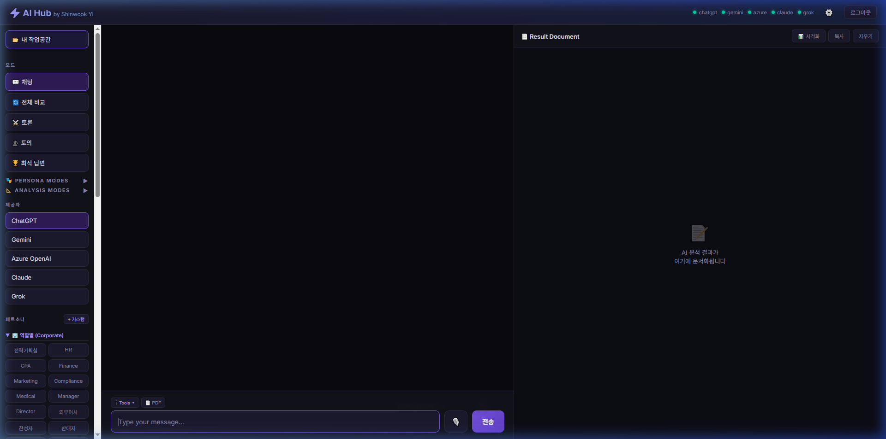
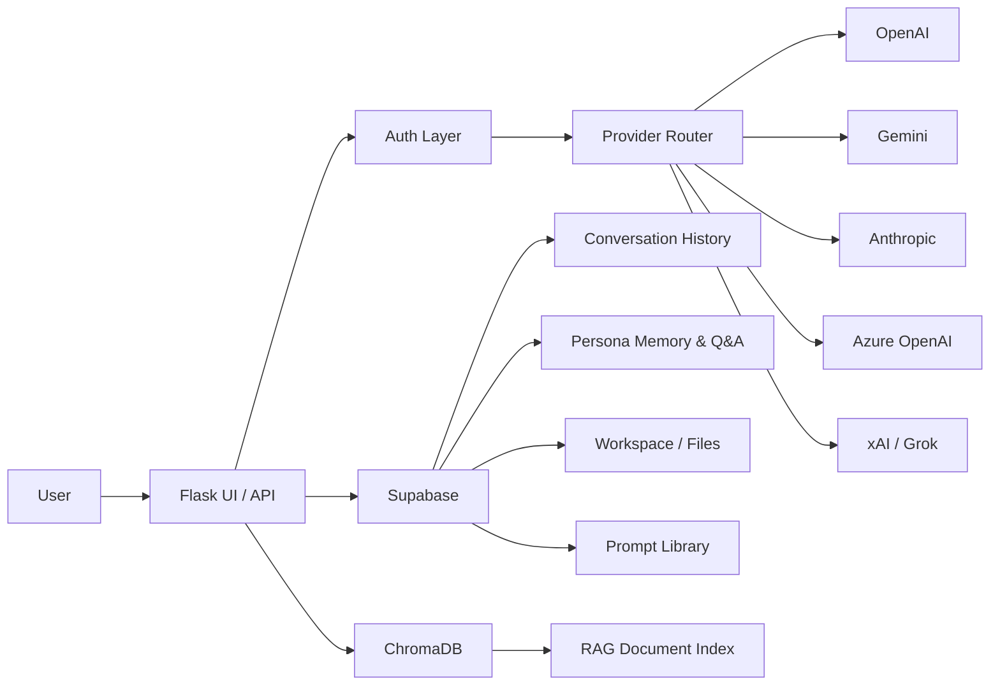

# ⚡ AI Hub — By Shinwook Yi, CPA, MBA


**Multi-AI Platform** — Access ChatGPT, Gemini, Azure OpenAI, Claude, and Grok through a single unified interface with AI-generated personas, multi-stakeholder analysis modes, and enterprise-grade security.

🌐 **Live Demo**: [https://ai-hub-zqpf.onrender.com](https://ai-hub-zqpf.onrender.com/)



---

## 👨‍💻 Author

**Shinwook Yi, CPA, MBA**

## 🛠️ Development Approach

**What I built vs AI-assisted:**

- **Architecture & Implementation**: I designed the system architecture, built the Flask app, and integrated multiple provider SDKs with unified routing.
- **AI-assisted workflow**: Parts of development were accelerated using AI-assisted coding, with manual review, testing, and iterative refactoring.

---

## ✨ Features

### 🤖 5 AI Providers in One Place
| Provider | Model | API |
|----------|-------|-----|
| **ChatGPT** | gpt-4o-mini | OpenAI |
| **Gemini** | gemini-2.5-flash | Google AI |
| **Azure OpenAI** | gpt-4o-mini | Microsoft Azure |
| **Claude** | claude-sonnet-4 | Anthropic |
| **Grok** | grok-3-mini-fast | xAI |

### 🎯 11 Interaction Modes
- 💬 **Chat** — 1-on-1 conversation with any AI (with real-time SSE streaming)
- 🔄 **Compare All** — Ask all AIs simultaneously and compare responses side by side
- ⚔️ **Debate** — AI vs AI structured debate on any topic
- 🗣️ **Discussion** — Round-robin discussion with all available AIs
- 🏆 **Best Answer** — All AIs answer, then cross-evaluate and vote for the best
- 🎭 **Persona Debate** — Role-play debate between historical figures
- 🧠 **Persona Discussion** — Group discussion with multiple personas
- 📊 **Multi-Persona Report** — Selected personas analyze a topic → executive report (SSE streaming)
- ⚖️ **Decision Matrix** — Score options × criteria with persona evaluators
- 🔗 **Chain Analysis** — Sequential analysis, each persona builds on previous (SSE streaming)
- 🗳️ **Persona Vote** — All personas vote APPROVE/OPPOSE/CONDITIONAL on a proposal (SSE streaming)

### 🎨 AI Image Generation (DALL-E 3)
- Type `/image`, `/그림`, or `/이미지` followed by a description
- Supports size, quality, and style parameters
- Generated images display with prompt, revised prompt, and download button

### 📋 Document Templates
One-click professional document generation via sidebar **Templates** section:
- 📊 **사업계획서** (Business Plan) — 10-section structure with TAM/SAM/SOM
- 📝 **제안서** (Proposal) — Project overview, timeline, budget, KPIs
- 📑 **보고서** (Report) — Executive summary, analysis, conclusions
- 📋 **회의록** (Meeting Minutes) — Attendees, agenda, action items
- 👤 **이력서** (Resume) — Career, education, skills
- 📜 **계약서** (Contract) — Terms, conditions, signatures

### 🧠 Strategy Analysis Frameworks
Sidebar **Strategy** section with 5 professional analysis frameworks:
- 📊 **SWOT Analysis** — Strengths, Weaknesses, Opportunities, Threats + SO/WO/ST/WT strategies
- 🌍 **PEST Analysis** — Political, Economic, Social, Technological factors
- ⚔️ **Porter's 5 Forces** — Competition intensity, barriers, substitutes, buyer/supplier power
- 📈 **BCG Matrix** — Star, Cash Cow, Question Mark, Dog classification
- 🎯 **Business Model Canvas** — 9 building blocks of a business model

### 📊 Data Analysis Command
- Type `/analyze [topic]` or `/분석 [주제]` for structured data analysis
- Auto-generates: overview, data tables, key insights, visualization suggestions, conclusions
- Works with uploaded file data when available

### ✏️ Editable Document Editor
- **Edit Mode** — Click ✏️ Edit button to make the output panel editable (like Notion/Google Docs)
- **Save** — 💾 Save to Supabase + download as styled HTML
- **Rich Editing** — Full contenteditable support with inline formatting

### 🚀 Real-Time SSE Streaming
Multi-persona modes (Report, Chain, Vote) use **Server-Sent Events** to stream each persona's response in real-time instead of waiting for all to complete. This prevents timeout errors and provides instant visual feedback as each persona reports.

### 🧠 AI-Generated Persona System
Users **create their own personas** by providing a name or job title. AI automatically generates:

- **System Prompt** — Expertise, personality, and communication style
- **Traits** — 5-8 core trait keywords (e.g., analytical, creative)
- **Skills** — 3-5 key professional skills
- **Communication Style** — How the persona responds

**Tier-Based Limits:**

| Tier | Stars | Max Personas |
|------|-------|---------||
| Free | ⭐ | 1 |
| Premium | ⭐⭐ | 3 |
| Admin | ⭐⭐⭐ | 5 |
| Owner | ⭐⭐⭐⭐ | 50 |

**75+ Built-in Personas** also available for debate modes (Corporate, Advisory, Function, Owner groups).

### 🔄 Persona Self-Evolution
Each persona **accumulates knowledge** and evolves through conversations:

| System | Description |
|--------|-------------|
| 💡 **Key Insights** | AI auto-extracts 1-line insights after each conversation (max 20 loaded) |
| 💬 **Q&A History** | Full question-answer pairs stored and loaded (recent 10 pairs) |

- **Memory injection**: Combined insights + Q&A history injected into persona system prompt
- **Memory panel**: Click a persona → view insights, Q&A history, add/delete/clear
- Personas grow smarter over time through accumulated context
- Memories are per-user, per-persona — private and isolated

### 🚀 Advanced Analysis Modes
| Mode | Description |
|------|-------------|
| 📊 **Multi-Persona Report** | All selected personas analyze a topic → synthesized executive report |
| ⚖️ **Decision Matrix** | Evaluate options against criteria → scored by selected personas → final scorecard |
| 🔗 **Chain Analysis** | Sequential analysis — each persona builds on the previous one's output |
| 🗳️ **Persona Vote** | All personas vote APPROVE/OPPOSE/CONDITIONAL on a proposal → tally + summary |
| 📋 **Prompt Library** | Save, load, and manage reusable prompt templates |

### 🛠️ Convenience Features
- **🧠 AI Persona Creation** — Enter a name/job → AI auto-generates traits, skills, and system prompt.
  - User can add extra traits; persona self-evolves through conversations.
  - **Tier-based Limits**: Free: 1, Premium: 3, Admin: 5, Owner: 50 personas.
- **📄 Multi-Format Export** — Export output panel as PDF, HTML, Word (.doc), Excel (.xls), or CSV
- **🎙️ Voice Input (STT)** — Web Speech API, auto-sends on final result
- **📋 Save/Load Prompts** — Supabase-backed prompt template management
- **📊 Visualize** — One-click AI analysis → generates Chart.js charts or Mermaid diagrams from data

### 🎨 Theme System (5 Themes)
| Theme | Preview |
|-------|---------|
| 🌑 **Dark** | Deep dark with purple accents (default) |
| 🌘 **Dim** | GitHub-inspired dim with blue accents |
| ☀️ **Light** | Clean, bright white UI |
| 🔥 **Warm** | Warm amber tones, golden accents |
| 🌊 **Ocean** | Deep ocean blues, teal accents |

### 📊 Rich Visualization
- **Markdown** rendering via `marked.js` with Notion/Gemini/Claude-style typography
- **Mermaid** diagrams (flowcharts, sequence diagrams, etc.) with dark theme
- **Chart.js** charts (pie, bar, line, doughnut) with auto-color palettes
- **📊 Visualize button** — AI analyzes output data and auto-generates the best visualization
- **Premium Typography** — Compact spacing, accent-colored headings, gradient borders, styled code blocks

### 📁 File Support & RAG
- Multi-file upload with drag & drop
- Supports PDF, DOCX, XLSX, CSV, TXT, and 15+ more formats
- **AI Vision OCR** — Image-based PDFs auto-scanned via GPT-4o vision
- **RAG Document Indexing** — Uploaded files are chunk-indexed via ChromaDB for intelligent context retrieval
- URL fetching for web page analysis (BeautifulSoup extraction)

### 💾 Persistent Conversation History
- Cloud database storage via **Supabase** (PostgreSQL)
- Browse and reload past conversations
- Auto-save on every message

### 🌐 Multi-Language System
**UI Auto-Translation** — Browser language detected via `navigator.language`, UI elements auto-translate:
- 🇺🇸 English · 🇰🇷 한국어 · 🇯🇵 日本語 · 🇨🇳 中文 · 🇪🇸 Español

**AI Response Language** — Two rules:
1. **Default**: AI responds in the same language as your message
2. **Override**: If you explicitly request a language (e.g. "answer in English", "한국어로 해줘"), AI uses that language regardless of input

### 🎤 Voice Support
- 🎙️ **Speech-to-Text** — Click the mic button, speak, and auto-send
- 🔊 **Text-to-Speech (OpenAI TTS)** — Natural AI voice (Nova) with browser TTS fallback
- 🎧 **Audio File Transcription (Whisper)** — Upload MP3/WAV/M4A → auto-transcribe and analyze
- Supports multiple languages

### 📊 AI Slide Generation
- Type `/slides [topic]` in chat to auto-generate 6-10 slide presentations
- **Output Panel Preview** — View slides as styled cards
- **Download PPTX** — Export as PowerPoint file (dark theme)
- **Slideshow Mode** — Full-screen browser presentation using reveal.js

### 📂 Personal Workspace
- Create **folders** with custom icons and descriptions to organize projects
  - **Nested Folders**: Supports folder hierarchy up to 3 levels deep (`Root → Folder → Subfolder`).
- **Rich Note Editor** — Multi-line textarea in the Output panel with Save button
- **Save Chat** — Save current AI conversation to a folder for later use
- **Save Slides** — Save generated presentations to a folder
- 💾 **Save & Direct Upload Files** — Save uploaded PDFs/CSV/DOCX from chat, or directly upload files into workspace folders using the `+ Upload File` button.
  - Extracted text content is stored with original file metadata (name, size, character count)
  - Supports single and multi-file batch saving
- 📌 **Pin files** — Pin important files to the top of the list
- 🤖 **One-click AI** — Ask AI / Continue / Develop buttons per file
  - Notes → AI analyzes, expands, and suggests improvements
  - Conversations → AI continues the discussion
  - Slides → AI suggests improvements and additional content
  - Files → AI analyzes and summarizes the content

### 📊 Responsive Spreadsheet
- **Auto-render** — CSV/Excel files automatically display as interactive spreadsheets in the Output panel
- **Excel-style UI** — Column letters (A, B, C...), row numbers, sticky headers
- **Cell editing** — Click any cell to edit content directly
- **AI Analysis** — One-click button sends headers + sample data to AI for insights
- **CSV Export** — Download edited spreadsheet as CSV file
- **500-row display** — Performance-safe rendering with overflow indicator
- **Mobile responsive** — Horizontal scroll + compact layout on small screens

### 🔲 Resizable Split Panel
- **Drag to resize** — Vertical divider between Chat and Output panels
- **Mouse + Touch** — Works on desktop and mobile
- **Persistent** — Split ratio saved to `localStorage` and restored on reload
- **Double-click** — Reset to default 42% ratio
- **Output toggle** — Close/reopen output panel; divider syncs visibility

### 🔐 Security & User Management
| Feature | Description |
|---------|-------------|
| **Multi-User Auth** | Supabase `users` table with SHA-256 hashed passwords (env-var fallback) |
| **Admin Panel** | ⚙️ button → manage users: add, delete, toggle active, change tier, reset password |
| **Tiered Rate Limiting** | `owner/admin`: **unlimited**, `premium`: 60 req/min, `free`: 20 req/min |
| **Login Protection** | 20 attempts/min per IP to prevent brute force |
| **Session Timeout** | Auto-logout after 2 hours of inactivity (configurable) |
| **Password Change** | Self-service password change via API for Supabase users |
| **Temp Password** | Admin can set temporary password with forced-change flag |
| **Auto-Seed** | Admin + guest users auto-created/synced in Supabase on every startup |
| **Session Info** | Live display: first login, last login, session timer, IP, geolocation |

Configure via environment variables:
```bash
export SESSION_TIMEOUT_HOURS=2  # Session timeout in hours
export PASSWORD_SALT=your_salt  # Custom salt for password hashing
```

### 📱 Mobile Responsive
- Hamburger menu for sidebar navigation
- Single-panel view with Chat/Output tab switcher
- Persona and Mode tabs accessible via header on mobile
- **Full-screen Output Panel** — 100% height with absolute positioning on mobile
- **← Back Button** — Physical button to return from Output to Chat
- Optimized layout for all screen sizes

### 🌐 Supported Browsers
| Browser | STT (Mic) | TTS (Speaker) |
|---------|-----------|---------------|
| **Chrome** | ✅ | ✅ |
| **Edge** | ✅ | ✅ |
| **Safari** | ⚠️ Limited | ✅ |
| **Firefox** | ❌ | ✅ |

---

## 🚀 Quick Start

### Prerequisites
- Python 3.10+
- At least 1 API key: OpenAI, Gemini, Anthropic, or xAI

### Installation

```bash
git clone https://github.com/shinwookyi-oss/ai-hub.git
cd ai-hub
pip install -r requirements.txt
```

### Environment Variables

```bash
# Required (at least 1)
export OPENAI_API_KEY=sk-...
export GEMINI_API_KEY=AIza...
export ANTHROPIC_API_KEY=sk-ant-...
export GROK_API_KEY=xai-...

# Optional
export AZURE_OPENAI_API_KEY=...
export AZURE_OPENAI_ENDPOINT=https://...

# Conversation History & Memory (Supabase)
export SUPABASE_URL=https://xxx.supabase.co
export SUPABASE_KEY=eyJ...
export SUPABASE_SERVICE_KEY=eyJ...  # Service role key (bypasses RLS for admin ops)

# Authentication (defaults: admin / aihub2026)
export APP_USERNAME=admin
export APP_PASSWORD=your_password
export SECRET_KEY=your_flask_secret  # Auto-generated if not set
```

### Supabase Tables Required
```sql
-- User management
CREATE TABLE users (
  id UUID DEFAULT gen_random_uuid() PRIMARY KEY,
  username TEXT UNIQUE NOT NULL,
  password_hash TEXT NOT NULL,
  tier TEXT DEFAULT 'free' CHECK (tier IN ('owner', 'admin', 'premium', 'free')),
  display_name TEXT,
  email TEXT,
  phone TEXT,
  is_active BOOLEAN DEFAULT TRUE,
  temp_password TEXT,
  must_change_password BOOLEAN DEFAULT FALSE,
  total_time_minutes INTEGER DEFAULT 0,
  created_at TIMESTAMPTZ DEFAULT NOW(),
  last_login TIMESTAMPTZ
);

-- User personas
CREATE TABLE user_personas (
  id UUID DEFAULT gen_random_uuid() PRIMARY KEY,
  username TEXT NOT NULL,
  persona_keys JSONB DEFAULT '[]',
  created_at TIMESTAMPTZ DEFAULT NOW()
);

-- Conversation history
CREATE TABLE conversations (
  id UUID DEFAULT gen_random_uuid() PRIMARY KEY,
  username TEXT NOT NULL,
  title TEXT DEFAULT 'New Chat',
  mode TEXT DEFAULT 'chat',
  created_at TIMESTAMPTZ DEFAULT NOW(),
  updated_at TIMESTAMPTZ DEFAULT NOW()
);

CREATE TABLE messages (
  id UUID DEFAULT gen_random_uuid() PRIMARY KEY,
  conversation_id UUID REFERENCES conversations(id) ON DELETE CASCADE,
  role TEXT NOT NULL,
  speaker TEXT,
  content TEXT NOT NULL,
  provider TEXT,
  model TEXT,
  badge TEXT,
  elapsed_seconds FLOAT,
  created_at TIMESTAMPTZ DEFAULT NOW()
);

-- Persona memory (insights)
CREATE TABLE persona_memory (
  id UUID DEFAULT gen_random_uuid() PRIMARY KEY,
  user_id TEXT NOT NULL, persona_key TEXT NOT NULL,
  content TEXT NOT NULL, created_at TIMESTAMPTZ DEFAULT NOW()
);

-- Persona conversations (Q&A history)
CREATE TABLE persona_conversations (
  id UUID DEFAULT gen_random_uuid() PRIMARY KEY,
  user_id TEXT NOT NULL, persona_key TEXT NOT NULL,
  question TEXT NOT NULL, answer TEXT NOT NULL,
  provider TEXT DEFAULT 'chatgpt', created_at TIMESTAMPTZ DEFAULT NOW()
);

-- Prompt library
CREATE TABLE saved_prompts (
  id UUID DEFAULT gen_random_uuid() PRIMARY KEY,
  user_id TEXT NOT NULL, name TEXT NOT NULL,
  prompt TEXT NOT NULL, mode TEXT DEFAULT 'chat',
  personas JSONB DEFAULT '[]', created_at TIMESTAMPTZ DEFAULT NOW()
);

-- Workspace
CREATE TABLE folders (
  id UUID DEFAULT gen_random_uuid() PRIMARY KEY,
  user_id TEXT NOT NULL,
  name TEXT NOT NULL,
  icon TEXT DEFAULT '📁',
  description TEXT,
  created_at TIMESTAMPTZ DEFAULT NOW()
);

CREATE TABLE workspace_files (
  id UUID DEFAULT gen_random_uuid() PRIMARY KEY,
  folder_id UUID REFERENCES folders(id) ON DELETE CASCADE,
  user_id TEXT NOT NULL,
  name TEXT NOT NULL,
  type TEXT DEFAULT 'note',
  content TEXT,
  metadata JSONB DEFAULT '{}',
  created_at TIMESTAMPTZ DEFAULT NOW(),
  updated_at TIMESTAMPTZ DEFAULT NOW()
);
```

### Run Locally

```bash
python app.py
```

Open http://localhost:5000

---

## ☁️ Cloud Deployment (Render)

1. Connect your GitHub repo to [Render](https://render.com)
2. Set **Environment Variables** with your API keys
3. Build Command: `pip install -r requirements.txt`
4. Start Command: `gunicorn app:app --bind 0.0.0.0:$PORT --timeout 300 --workers 1 --max-requests 200`

## 🐳 Docker / NAS Deployment (QNAP)

```bash
# Clone and configure
git clone https://github.com/shinwookyi-oss/ai-hub.git
cd ai-hub

# Edit docker-compose.yml with your API keys, then:
docker-compose up -d
```

- Pre-configured `Dockerfile` + `docker-compose.yml` for QNAP Container Station
- Gunicorn production server with health checks
- Persistent volume for uploads
- Port 5000 exposed

---

## 📁 Project Structure

```
ai-hub/
├── app.py              # Flask app (UI + API routes + auth + SSE streaming + admin panel)
├── ai_hub.py           # AIHub core (5 providers, 75+ personas, AI persona gen, 11 modes, memory, RAG)
├── templates/
│   ├── index.html      # Main SPA (2500+ lines: UI + JS logic + templates + strategy)
│   └── login.html      # Login page with Spline 3D background
├── static/
│   ├── css/style.css   # Full design system (5 themes, responsive, 580+ lines)
│   ├── img/            # Logo, favicon, and assets
│   └── js/             # Additional scripts
├── docs.html           # Interactive API documentation
├── Dockerfile          # Docker container for NAS deployment
├── docker-compose.yml  # Docker Compose with env vars and health checks
├── .dockerignore       # Docker build exclusions
├── requirements.txt    # Python dependencies
├── Procfile            # Render deployment config
└── .gitignore
```

---

## 🔧 Tech Stack

| Layer | Technology |
|-------|-----------|
| Backend | Python, Flask, SSE Streaming |
| Frontend | Vanilla HTML/CSS/JS (Split-panel SPA) |
| AI SDKs | OpenAI, Google GenAI, Anthropic |
| Image Gen | DALL-E 3 (OpenAI) |
| Voice | OpenAI TTS (Nova), OpenAI Whisper, Web Speech API |
| Slides | python-pptx, reveal.js |
| Database | Supabase (PostgreSQL) |
| RAG | ChromaDB (document chunk indexing) |
| Hosting | Render (gunicorn), Docker (QNAP NAS) |
| Visualization | Mermaid.js, Chart.js, Marked.js |
| Export | html2pdf.js, SheetJS (XLSX) |
| Spreadsheet | Pure HTML/CSS/JS (no external library) |

---

## 🏗️ How It Works (Architecture)



**Request Flow:**
```
User → Flask UI/API → Auth Layer → Provider Router → AI Providers (OpenAI / Gemini / Anthropic / xAI / Azure)
                                                   ↘ Supabase (History · Memory · Workspace · Prompts)
                                                   ↘ ChromaDB (RAG · Document Indexing)
```

---

## 📄 License

Private project.

---

**Built with ❤️ by Shinwook Yi**
