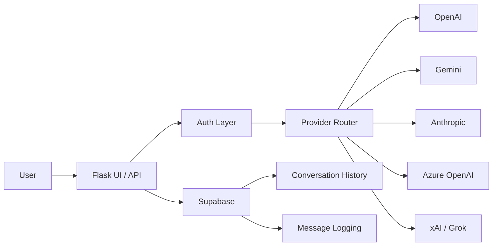

# ⚡ AI Hub — By Shinwook Yi

**Multi-AI Platform** — Access ChatGPT, Gemini, Azure OpenAI, Claude, and Grok through a single unified interface.

🌐 **Live Demo**: [shinwookyi-ai.onrender.com](https://ai-hub-zqpf.onrender.com/))

---

## ✨ Features

### 🤖 5 AI Providers in One Place
| Provider | Model | API |
|----------|-------|-----|
| **ChatGPT** | gpt-4o-mini | OpenAI |
| **Gemini** | gemini-2.5-flash | Google AI |
| **Azure OpenAI** | gpt-4o-mini | Microsoft Azure |
| **Claude** | claude-sonnet-4 | Anthropic |
| **Grok** | grok-3-mini-fast | xAI |

### 🎯 7 Interaction Modes
- 💬 **Chat** — 1-on-1 conversation with any AI
- 🔄 **Compare All** — Ask all AIs simultaneously and compare responses side by side
- ⚔️ **Debate** — AI vs AI structured debate on any topic
- 🗣️ **Discussion** — Round-robin discussion with all available AIs
- 🏆 **Best Answer** — All AIs answer, then cross-evaluate and vote for the best
- 🎭 **Persona Debate** — Role-play debate between historical figures
- 🧠 **Persona Discussion** — Group discussion with multiple personas

### 👤 20+ Persona System
Historical figures and expert personas that shape AI responses:

| Category | Personas |
|----------|---------|
| Business | Elon Musk, Steve Jobs, J.P. Morgan |
| Strategy | Sun Tzu, Sima Yi, Tokugawa Ieyasu |
| Philosophy | Nietzsche, Schopenhauer |
| Science | Nikola Tesla, Thomas Edison, Albert Einstein |
| Psychology | Carl Jung, FBI Profiler |
| Eastern Arts | I Ching Master, Saju (Four Pillars) Master |
| Assistants | Personal Assistant, Devil's Advocate |
| Politics | Donald Trump |

### 📊 Rich Visualization
- **Markdown** rendering with syntax highlighting
- **Mermaid** diagrams (flowcharts, sequence diagrams, etc.)
- **Chart.js** charts (pie, bar, line charts)

### 📁 File Support
- Multi-file upload with drag & drop
- Supports PDF, DOCX, XLSX, CSV, TXT, and more
- URL fetching for web page analysis

### 💾 Persistent Conversation History
- Cloud database storage via **Supabase** (PostgreSQL)
- Browse and reload past conversations
- Auto-save on every message

### 🌐 Auto Language Detection
- Automatically detects user language (Korean, English, Japanese, etc.)
- Responds in the same language

### 🎤 Voice Support
- 🎙️ **Speech-to-Text** — Click the mic button, speak, and auto-send
- 🔊 **Text-to-Speech (OpenAI TTS)** — Natural AI voice (Nova) with browser TTS fallback
- 🎧 **Audio File Transcription (Whisper)** — Upload MP3/WAV/M4A → auto-transcribe and analyze
- Supports multiple languages

### 📊 AI Slide Generation
- Type `/slides [topic]` in chat to auto-generate 6-10 slide presentations
- **Output Panel Preview** — View slides as styled cards
- **Download PPTX** — Export as PowerPoint file (dark theme)
- **Slideshow Mode** — Full-screen browser presentation using reveal.js

### 📂 Personal Workspace
- Create **folders** with custom icons and descriptions to organize projects
- **Rich Note Editor** — Multi-line textarea in the Output panel with Save button
- **Save Chat** — Save current AI conversation to a folder for later use
- **Save Slides** — Save generated presentations to a folder
- 📌 **Pin files** — Pin important files to the top of the list
- 🤖 **One-click AI** — Ask AI / Continue / Develop buttons per file
  - Notes → AI analyzes, expands, and suggests improvements
  - Conversations → AI continues the discussion
  - Slides → AI suggests improvements and additional content

### 📱 Mobile Responsive
- Hamburger menu for sidebar navigation
- Single-panel view with Chat/Output tab switcher
- Optimized layout for all screen sizes

### 🌐 Supported Browsers
| Browser | STT (Mic) | TTS (Speaker) |
|---------|-----------|---------------|
| **Chrome** | ✅ | ✅ |
| **Edge** | ✅ | ✅ |
| **Safari** | ⚠️ Limited | ✅ |
| **Firefox** | ❌ | ✅ |

---

## 🚀 Quick Start

### Prerequisites
- Python 3.10+
- At least 1 API key: OpenAI, Gemini, Anthropic, or xAI

### Installation

```bash
git clone https://github.com/shinwookyi-oss/ai-hub.git
cd ai-hub
pip install -r requirements.txt
```

### Environment Variables

```bash
# Required (at least 1)
export OPENAI_API_KEY=sk-...
export GEMINI_API_KEY=AIza...
export ANTHROPIC_API_KEY=sk-ant-...
export GROK_API_KEY=xai-...

# Optional
export AZURE_OPENAI_API_KEY=...
export AZURE_OPENAI_ENDPOINT=https://...

# Conversation History (Supabase)
export SUPABASE_URL=https://xxx.supabase.co
export SUPABASE_KEY=eyJ...

# Authentication (defaults: admin / aihub2026)
export APP_USERNAME=admin
export APP_PASSWORD=your_password
```

### Run Locally

```bash
python app.py
```

Open http://localhost:5000

---

## ☁️ Cloud Deployment (Render)

1. Connect your GitHub repo to [Render](https://render.com)
2. Set **Environment Variables** with your API keys
3. Build Command: `pip install -r requirements.txt`
4. Start Command: `gunicorn app:app --bind 0.0.0.0:$PORT --timeout 300`

---

## 📁 Project Structure

```
ai-hub/
├── app.py              # Flask app (UI + API routes + auth)
├── ai_hub.py           # AIHub core class (5 providers, personas, modes)
├── requirements.txt    # Python dependencies
├── Procfile            # Render/Heroku deployment config
└── .gitignore
```

---

## 🔧 Tech Stack

| Layer | Technology |
|-------|-----------|
| Backend | Python, Flask |
| Frontend | Vanilla HTML/CSS/JS (Genspark-style split panel) |
| AI SDKs | OpenAI, Google GenAI, Anthropic |
| Voice | OpenAI TTS (Nova), OpenAI Whisper, Web Speech API |
| Slides | python-pptx, reveal.js |
| Database | Supabase (PostgreSQL) |
| Hosting | Render |
| Visualization | Mermaid.js, Chart.js, Marked.js |

---

## 🏗️ How It Works (Architecture)



**Request Flow:**
```
User → Flask UI/API → Auth Layer → Provider Router → AI Providers (OpenAI / Gemini / Anthropic / xAI / Azure)
                                                   ↘ Supabase (Logging & History)
```

---

## 🛠️ Development Approach

**What I built vs AI-assisted:**

- **Architecture & Implementation**: I designed the system architecture, built the Flask app, and integrated multiple provider SDKs with unified routing.
- **AI-assisted workflow**: Parts of development were accelerated using AI-assisted coding, with manual review, testing, and iterative refactoring.

---

## 📄 License

Private project.

---

## 👨‍💻 Author

**shinwookyi-oss**
